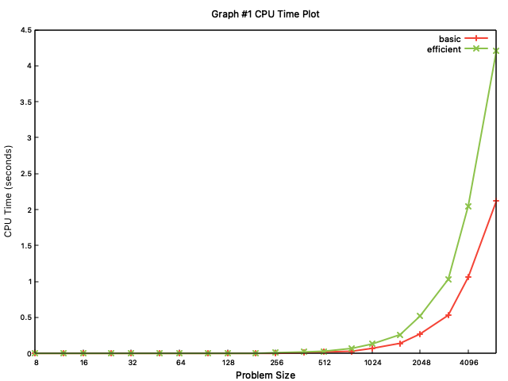
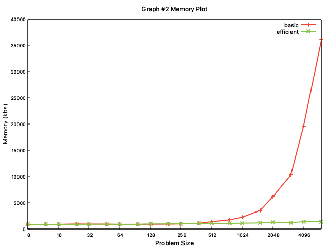

# CSCI570_Final_Project
The project is related to the implementation of the two different solutions provided in chapter 6 of the Kleinberg textbook for the Sequence Alignment problem (see [project description](CSCI570_Fall2021_FinalProject.pdf)).
- [x] [Basic](src/basic.cpp) implementation
- [x] [Efficient](src/efficient.cpp) implementation
- [x] [Graphs](graphs)
- [ ] Summary
- [ ] Shell script

## Compile & Run
```bash
# Compile
cd build  
cmake ..  
make  

# Run basic program
./basic ../data/input.txt

# Run efficient program
./efficient ../data/input.txt
```
## Measure time & memory performance
```bash
# Measure programs and write metrics into the corresponding output files
# %e - Elapsed real time (in seconds).
# %M - Maximum resident set size of the process during its lifetime (in Kbytes).

# Measure basic program
/usr/bin/time -a -f "%e\n%M" -o ../data/output_basic.txt ./basic ../data/input.txt

# Measure efficient program
/usr/bin/time -a -f "%e\n%M" -o ../data/output_efficient.txt ./efficient ../data/input.txt
```
## Graphs



## Note  
> The optimal table is unique but the optimal alignment is not unique
